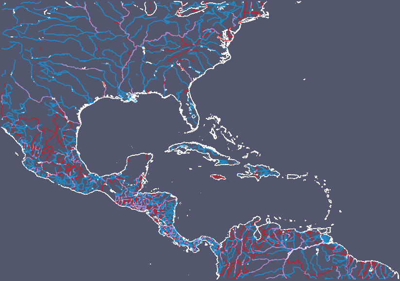

# Generating VTK Files for Coastline, National Borders and River Network Dataset 

This document aims to provide detailed information about the usage of set of tools/scripts to generate datasets such as coastline, national borders and river networks that can used in the visualization under [ParaView](http://www.paraview.org) or any other tool that supports [VTK](http://www.vtk.org) format.

## Requirements

* Latest version of GSHHG (A Global Self-consistent, Hierarchical, High-resolution Geography Database): It can be downloaded from [here](https://www.ngdc.noaa.gov/mgg/shorelines/gshhs.html) (in *.shp format)
* NCAR Command Language ([NCL](http://www.ncl.ucar.edu))
* [domain2vtk.ncl](README_vtk_coastline/domain2vtk.ncl) and [domain2vtk.sh](README_vtk_coastline/domain2vtk.sh) scripts 

## Usage
### Parameters

1. Set **dtype** parameter in NCL script to following numbers generate coastline (**1**), national borders (**2**) and river networks (**3**).
2. Set dataset resolution using **cres** parameter. Also note that processing of higher resolution datasets will take more time (the default value is **i**, which indicates intermediate resolution).
3. **Optional:** If you see any wrongly connected points and lines, you can play with the **thold** parameter to split segments. It basically checks the distance between two follow-up points and check based on the defined threshold (unit is km).
4. The **dfile** parameter is mainly used to define the boundary of the region to extract information. The given [netCDF](https://www.unidata.ucar.edu/software/netcdf/) file is the domain file, which is produced by [RegCM](https://gforge.ictp.it/gf/project/regcm/) model. Also note that you could also make minor modification in the NCL code to supply custom **xbox** and **ybox** variables to define boundary.

### Run

The **domain2vtk.sh** shell script will automatically trigger NCL script to produce VTK file for coastline, national borders and river networks. To run the script, please simply type following command

```
> ./domain2vtk.sh
```

### Example Output

The following example shows output of coastline, national borders and river networks for Central America domain created by using ParaView.


 
