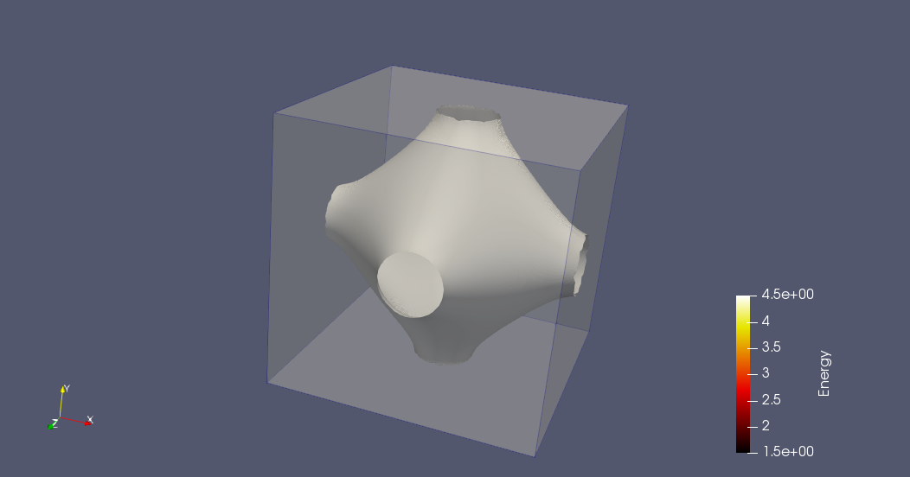
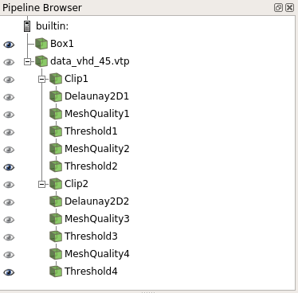
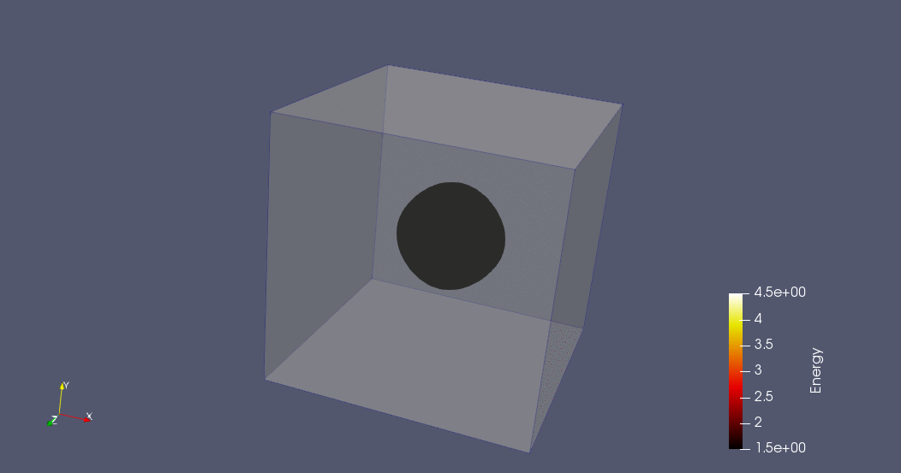
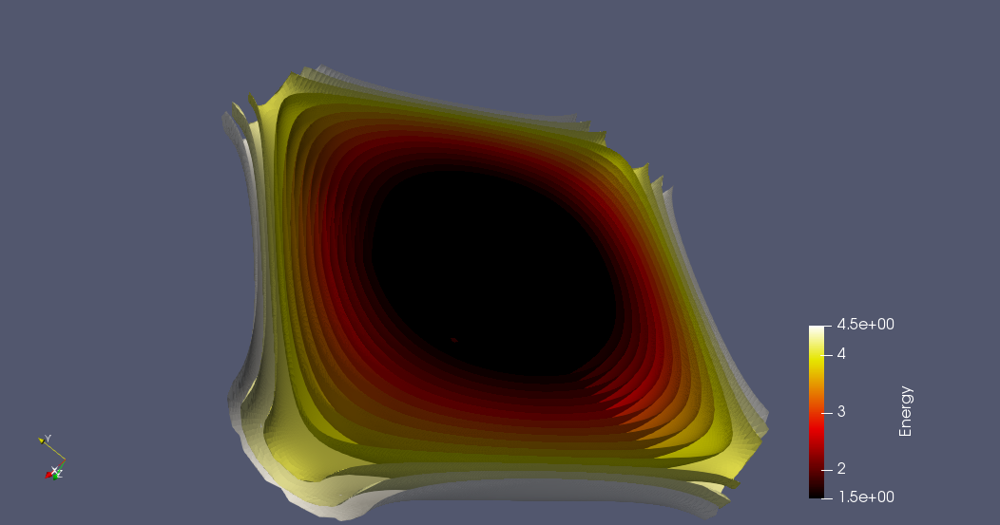
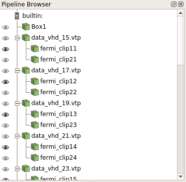

# Visualization of Fermi Surfaces using ParaView

This document aims to provide brief information about visualization of Fermi Surfaces using [ParaView](http://www.paraview.org) and [VTK](http://www.vtk.org) data format.

## Requirements

* [Python](https://www.python.org) installation with following modules
	* VTK (Visualization Toolkit)
	* Numpy
* [ParaView](https://www.paraview.org/download/)
	* Also note that the ParaView state files are compatible with version 5.4.1.

Python can required modules can be installed easily using [Anaconda](https://www.anaconda.com/download/#macos). The given codes are only tested under Linux operating system ([Centos](https://www.centos.org) 7.4).

## Data format conversion

The initial input data is in ASCII format (three columns that represent x, y and z coordinate of the constant energy surface) and needs to converted to VTK data format that ParaView can easly process. For this purpose, a data conversion code is written in Python using VTK module. The code can be found in [here](README_vtk_fermi_surface/ascii2vtk.py) as Python script or [here](README_vtk_fermi_surface/ascii2vtk.ipynb) as [Jupyter](http://jupyter.org) notebook.

An example ASCII input file belongs to 4.5 energy level can be found in [here](README_vtk_fermi_surface/3D_Fermi_energy_contour_4.5_VHD.txt). For the debuging purpose, data in same energy level is given [here](README_vtk_fermi_surface/data_vhd_45.vtp) in VTK format. 

## Example visualizations
### Animation of fermi surfaces of different energy levels

The following figure shows fermi surface in 4.5 energy level. 



In this case, the shown visualization pipeline (download from [here](README_vtk_fermi_surface/state_for_45.pvsm)) is used to split whole energy surface into two part along the z axis. By this way, the artifacts in the surface reconstruction step using Delaunay2D filter are minimized. The MeshFilter filter after triangulation step is used to clear remaining problematic regions in the generated surface.



The following figure shows the change in fermi surfaces between 1.5 and 4.5 energy levels with 0.2 interval. 



In this case, same visualization pipeline is applied to different energy levels (first need to create vtp files for all energy levels) to produce png files for each one of them. Then, [ImageMagick](http://imagemagick.org)'s convert command is used to create animated gif using following shell command.

```
convert -delay 10 -loop 0 *.png fermi_surface.gif
```

### Shell type static visualization of different fermi surfaces

The following figure, shows different fermi surfaces in a static representation.



In this case, previous visualization pipeline is also used in here but in this case it is applied to given energy levels (from 1.5 to 4.5) one-by-one to create shell type of representation (only half of it in z axis shown in here to show inside of the energy surfaces). To reduce the time to construct visualization pipeline, Clip1 and Clip2 part of the previous pipline is defined as a custom filter under ParaView. The state file for this visualization can be found in [here](README_vtk_fermi_surface/state_for_shell.pvsm).

