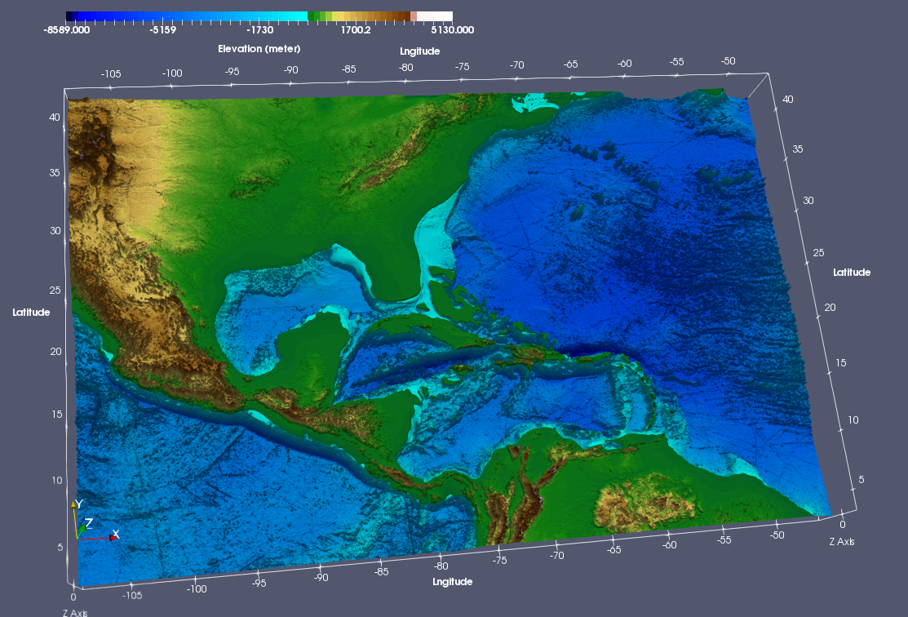

# Generating VTK Files for Topography/Bathymetry 

This document aims to provide detailed information about the usage of set of tools/scripts to generate topography/bathymetry dataset that can used in the visualization under [ParaView](http://www.paraview.org) or any other tool that supports [VTK](http://www.vtk.org) format.

## Requirements

* Latest version of ETOPO global topography dataset. The code can run with both [ETOPO1](https://www.ngdc.noaa.gov/mgg/global/relief/ETOPO1/data/ice_surface/grid_registered/netcdf/ETOPO1_Ice_g_gmt4.grd.gz) and [ETOPO2](https://www.ngdc.noaa.gov/mgg/global/relief/ETOPO2/ETOPO2v2-2006/ETOPO2v2g/netCDF/ETOPO2v2g_f4_netCDF.zip) datasets. Also note that the increase in the resolution of the dataset might slow down the process.
* NCAR Command Language ([NCL](http://www.ncl.ucar.edu))
* [topo2vtk.ncl](README_vtk_topo/topo2vtk.ncl) and [topo2vtk.sh](README_vtk_topo/topo2vtk.sh) scripts 

## Usage
### Parameters

1. The **dfile** parameter is mainly used to define the boundary of the region to extract information. The given [netCDF](https://www.unidata.ucar.edu/software/netcdf/) file is the domain file, which is produced by [RegCM](https://gforge.ictp.it/gf/project/regcm/) model. Also note that you could also make minor modification in the NCL code to supply custom **xbox** and **ybox** variables to define boundary.

### Run

The **topo2vtk.sh** shell script will automatically trigger NCL script to produce VTK file for topography/bathymetry. To run the script, please simply type following command

```
> ./topo2vtk.sh
```

### Example Output

The following example shows output of topography/bathymetry for Central America domain created by using ParaView.


 
